# MindLens
> AI 기반 문서 · 영상 분석 및 비교 플랫폼

<p align="center">
  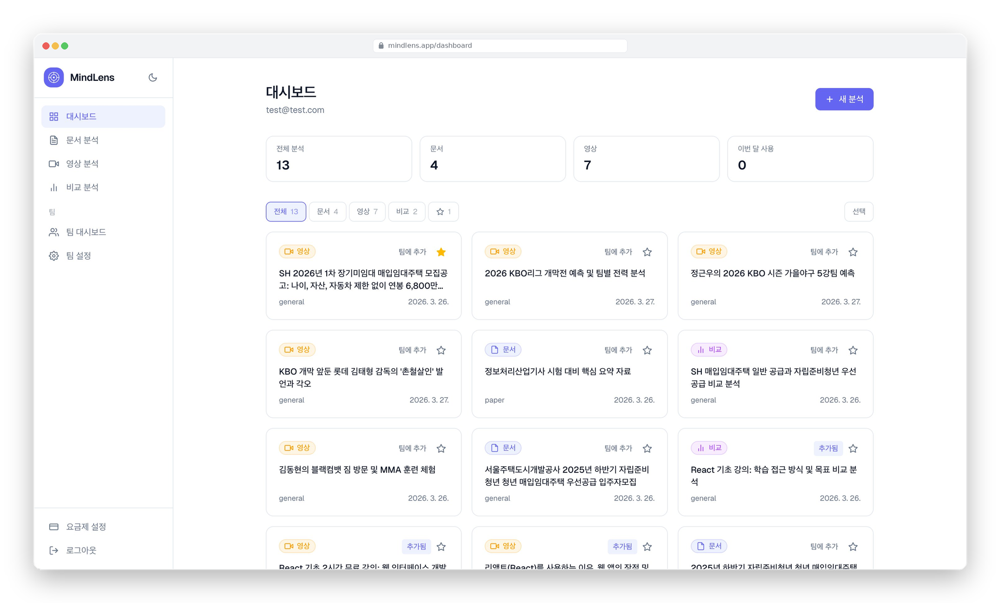
</p>

<p align="center">
  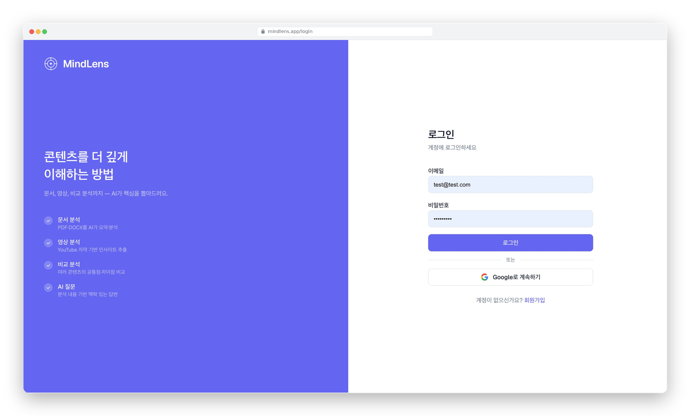
  &nbsp;
  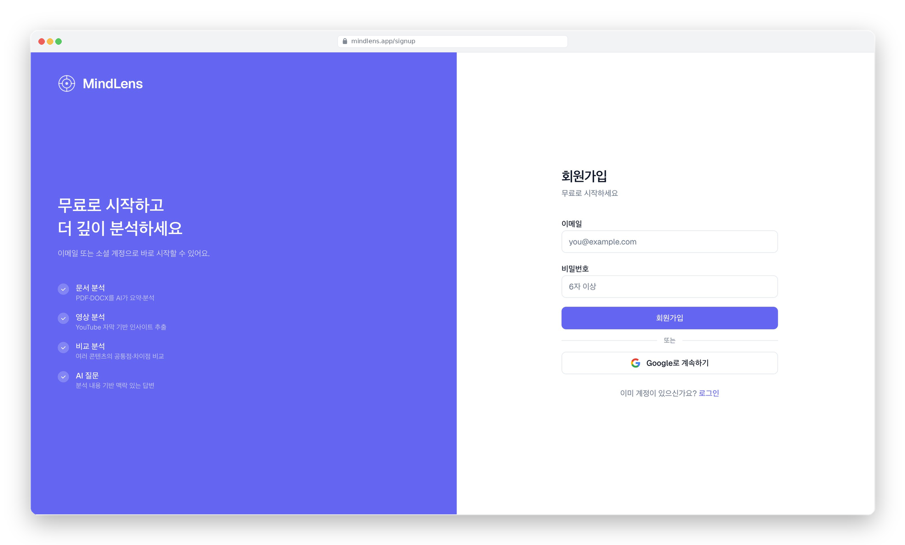
</p>

<br>

# 목차

[1-프로젝트 소개](#1-프로젝트-소개)

- [1-1 개요](#1-1-개요)
- [1-2 주요목표](#1-2-주요목표)
- [1-3 개발환경](#1-3-개발환경)
- [1-4 구동방법](#1-4-구동방법)

[2-Architecture](#2-architecture)
- [2-1 구조도](#2-1-구조도)
- [2-2 파일 디렉토리](#2-2-파일-디렉토리)

[3-프로젝트 특징](#3-프로젝트-특징)

[4-프로젝트 세부과정](#4-프로젝트-세부과정)

[5-업데이트 및 리팩토링 사항](#5-업데이트-및-리팩토링-사항)


---

## 1-프로젝트 소개

### 1-1 개요
> AI 기반 문서 · 영상 분석 및 비교 플랫폼
- **개발기간** : 2026.03.12 – 03.27
- **참여인원** : 1인 (개인 프로젝트)
- **주요특징**
  - PDF / DOCX 문서와 YouTube 영상을 AI로 분석하여 핵심 요약 · 키워드 · 인사이트 제공
  - Google Gemini API(`gemini-2.5-flash`) 기반 분석 및 실시간 스트리밍 Q&A 채팅
  - 2~3개 분석 결과 교차 비교 기능으로 콘텐츠 간 공통점 · 차이점 · 추천 제공
  - 무료 / Pro / Team 3단계 요금제 및 Toss Payments 기반 결제 시스템
  - 팀 공유 대시보드 · 초대 · 역할 관리(Leader / Admin / Member / Viewer)

### 1-2 주요목표
- Next.js App Router 기반 서버 컴포넌트와 클라이언트 컴포넌트 분리 설계
- Supabase RLS(Row Level Security) 정책을 활용한 데이터 접근 제어 구현
- Google Gemini API 연동 및 도메인 특화 프롬프트 전략 설계
- Toss Payments 기반 구독 결제 · 다운그레이드 · 유효기간 관리 구현
- 팀 기능 설계 및 역할 기반 권한 제어(RBAC) 구현

### 1-3 개발환경
- **활용기술 및 키워드**
  - **Framework** : Next.js 16 (App Router), TypeScript
  - **Styling** : Tailwind CSS v4
  - **Auth / DB / Storage** : Supabase (PostgreSQL + Auth + Storage)
  - **AI** : Google Gemini API (`gemini-2.5-flash`)
  - **결제** : Toss Payments SDK
  - **배포** : Vercel

- **외부 API**
  - YouTube Data API v3 (영상 제목 · 업로드 날짜 · 자막 유무 · 키워드 검색)
  - Supadata API (YouTube 자막 텍스트 추출)
  - Toss Payments API (결제 승인 확인)

- **라이브러리**
  - `@google/generative-ai` (Google Gemini API SDK)
  - `youtubei.js` (YouTube 자막 추출 — 클라이언트 대체 방식)
  - `pdf-parse` (PDF 텍스트 추출)
  - `mammoth` (DOCX 텍스트 추출)
  - `@tosspayments/tosspayments-sdk` (결제 SDK)
  - `next-themes` (다크모드 테마 전환)

### 1-4 구동방법

순서 | 내용 | 비고
---- | ----- | -----
1 | 프로젝트를 클론합니다 | `git clone` 후 IDE에서 열기
2 | 환경변수를 설정합니다 | 아래 환경변수 표 참고
3 | 패키지를 설치합니다 | `npm install`
4 | 개발 서버를 실행합니다 | `npm run dev`
5 | 브라우저에서 `http://localhost:3000`에 접속합니다 | Supabase 프로젝트 설정 필요

**환경변수 설정**

| 환경변수 | 설명 | 필수 |
|---------|------|------|
| `NEXT_PUBLIC_SUPABASE_URL` | Supabase 프로젝트 URL | O |
| `NEXT_PUBLIC_SUPABASE_ANON_KEY` | Supabase anon 키 | O |
| `SUPABASE_SERVICE_ROLE_KEY` | Supabase service role 키 | O |
| `GEMINI_API_KEY` | Google Gemini API 키 | O |
| `GEMINI_MODEL` | 사용할 Gemini 모델명 | O |
| `YOUTUBE_DATA_API_KEY` | YouTube Data API v3 키 | O |
| `NEXT_PUBLIC_TOSS_CLIENT_KEY` | Toss Payments 클라이언트 키 | O |
| `TOSS_SECRET_KEY` | Toss Payments 시크릿 키 | O |
| `SUPADATA_API_KEY` | Supadata YouTube 자막 API 키 | O |
| `STORAGE_BUCKET` | Supabase Storage 버킷명 | O |
| `GEMINI_MAX_TEXT_CHARS` | Gemini 분석 최대 문자수 (기본: 30000) | X |
| `FREE_ANALYSIS_LIMIT` | 무료 플랜 월 분석 횟수 (기본: 5) | X |
| `NEXT_PUBLIC_MAX_FILE_SIZE_MB` | 업로드 최대 파일 크기 MB (기본: 20) | X |
| `NEXT_PUBLIC_BASE_URL` | 배포 기본 URL (OG 메타데이터용) | X |

<br>

## 2-Architecture
### 2-1 구조도

<br>

> Next.js App Router + Server / Client Component 분리
- 서버 컴포넌트에서 Supabase 데이터 페칭 후 클라이언트 컴포넌트에 props로 전달
- API Route(`app/api/`)를 통한 AI 분석 · 팀 · 결제 등 서버사이드 로직 처리
- `(auth)` / `(app)` 라우트 그룹으로 인증 전후 레이아웃 분리

<br>

> Supabase 기반 인증 및 데이터 관리
- Supabase Auth를 활용한 이메일 · Google OAuth 로그인
- RLS(Row Level Security) 정책으로 테이블별 SELECT / INSERT / UPDATE / DELETE 접근 제어
- Supabase Storage를 통한 원본 문서 파일 보관

<br>

> Google Gemini API 연동
- `lib/gemini.ts`에 분석 함수 집중 관리 (`analyzeDocument`, `analyzeVideo`, `generateSuggestedQuestions`)
- 도메인별 프롬프트 지시문을 `domain_configs` 테이블에서 동적으로 조회하여 적용
- Q&A 채팅은 스트리밍 방식으로 응답하여 실시간 타이핑 효과 구현

<br>

> 요금제 및 결제
- Toss Payments SDK 기반 카드 결제 및 구독 관리
- `cancel_at_period_end` + `current_period_end` 방식으로 결제 기간 만료 후 다운그레이드 처리
- 페이지 접근 시 만료 감지 → 자동 정리(lazy cleanup) 방식으로 별도 cron 없이 구현

<br>

### 2-2 파일 디렉토리
```
mindlens/
 ├─ app/
 │   ├─ (auth)/
 │   │   ├─ login/page.tsx
 │   │   └─ signup/page.tsx
 │   ├─ (app)/
 │   │   ├─ layout.tsx
 │   │   ├─ dashboard/
 │   │   │   ├─ page.tsx
 │   │   │   └─ actions.ts
 │   │   ├─ analyze/
 │   │   │   ├─ document/page.tsx
 │   │   │   ├─ document/[id]/page.tsx
 │   │   │   ├─ video/page.tsx
 │   │   │   └─ video/[id]/page.tsx
 │   │   ├─ compare/
 │   │   │   ├─ page.tsx
 │   │   │   └─ [id]/page.tsx
 │   │   ├─ search/page.tsx
 │   │   ├─ team/
 │   │   │   ├─ page.tsx
 │   │   │   └─ settings/page.tsx
 │   │   └─ pricing/
 │   │       ├─ page.tsx            (서버 컴포넌트 — 플랜 fetch)
 │   │       ├─ pricing-client.tsx   (클라이언트 컴포넌트 — UI)
 │   │       └─ actions.ts
 │   ├─ api/
 │   │   ├─ analyze/
 │   │   │   ├─ document/route.ts
 │   │   │   └─ video/route.ts
 │   │   ├─ transcript/route.ts      (Supadata 자막 추출)
 │   │   ├─ check/caption/route.ts   (자막 유무 확인)
 │   │   ├─ compare/route.ts
 │   │   ├─ chat/route.ts
 │   │   ├─ suggest-questions/route.ts
 │   │   ├─ search/youtube/route.ts
 │   │   ├─ domains/route.ts
 │   │   ├─ payment/confirm/route.ts
 │   │   ├─ team/route.ts
 │   │   ├─ team/analyses/route.ts
 │   │   ├─ team/members/[id]/route.ts
 │   │   ├─ team/invite/route.ts
 │   │   ├─ team/api-keys/route.ts
 │   │   ├─ team/api-keys/[id]/route.ts
 │   │   └─ v1/analyses/route.ts     (팀 공개 API)
 │   ├─ auth/callback/route.ts       (OAuth 콜백)
 │   ├─ payment/
 │   │   ├─ success/page.tsx
 │   │   └─ fail/page.tsx
 │   ├─ share/[token]/page.tsx       (공유 링크 공개 뷰)
 │   ├─ layout.tsx                   (메타데이터 · OG 설정)
 │   └─ opengraph-image.tsx          (동적 OG 이미지)
 ├─ components/
 │   ├─ sidebar.tsx
 │   ├─ dashboard-grid.tsx
 │   ├─ analysis-chat.tsx
 │   ├─ recent-analyses-sidebar.tsx
 │   ├─ new-analysis-button.tsx
 │   ├─ export-button.tsx
 │   ├─ share-button.tsx
 │   ├─ related-videos.tsx
 │   ├─ social-auth-buttons.tsx
 │   ├─ auth-layout.tsx
 │   ├─ theme-provider.tsx
 │   ├─ theme-toggle.tsx
 │   └─ logo.tsx
 └─ lib/
     ├─ supabase/
     │   ├─ client.ts
     │   ├─ server.ts
     │   └─ service.ts
     ├─ gemini.ts
     ├─ youtube.ts
     ├─ youtube-transcript.ts
     └─ usage.ts
```

<br>

## 3-프로젝트 특징

<p align="center">
  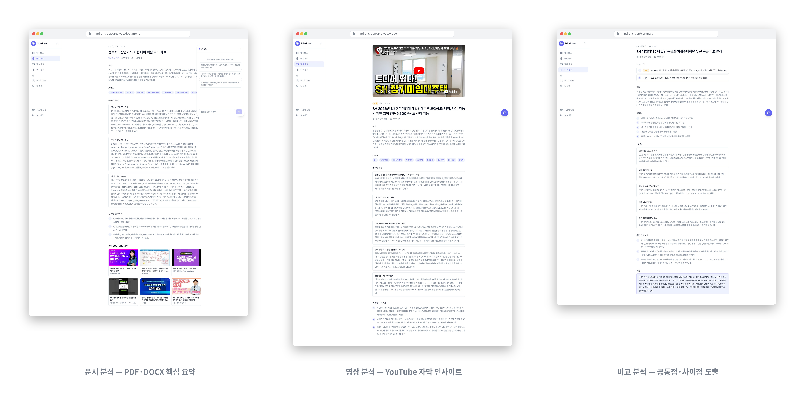
</p>

<br>

### 3-1 문서 분석 (Document Analysis)
- PDF / DOCX 파일 업로드 후 텍스트 추출 → Gemini 분석으로 핵심 요약 · 키워드 · 인사이트 제공
- 도메인 특화 모드(계약서 / 논문 / 보고서 / 이력서 / 일반)로 맥락에 맞는 분석 결과 제공
- 도메인별 프롬프트 지시문을 DB(`domain_configs`)에서 관리하여 코드 수정 없이 확장 가능
- 스캔 이미지 PDF는 텍스트 추출 불가 안내

<p align="center">
  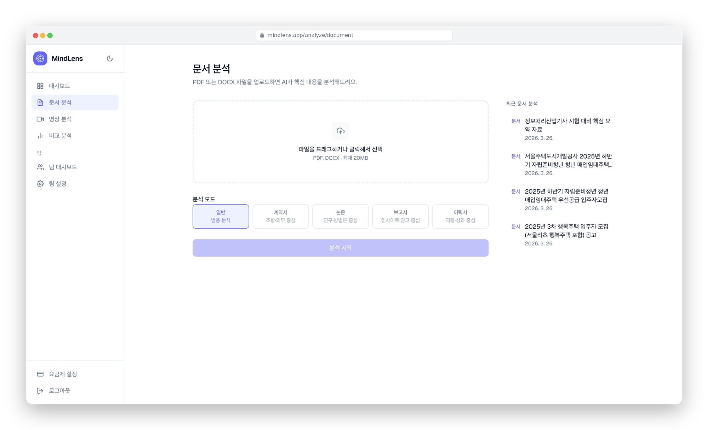
</p>

<br>

---

### 3-2 영상 분석 (Video Analysis)
- YouTube URL 입력 → Supadata API로 자막 추출 → Gemini 분석으로 구간별 요약 · 핵심 포인트 제공
- YouTube Data API v3로 영상 제목 · 업로드 날짜 메타데이터 함께 저장
- URL 입력 전 자막 유무 사전 확인 기능 (`contentDetails.caption` 활용)
- 키워드 검색으로 관련 YouTube 영상 Top 5 추천 기능 제공
- 분석 결과 기반 관련 영상 자동 추천

<p align="center">
  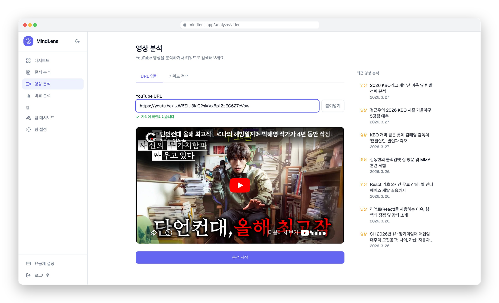
  &nbsp;
  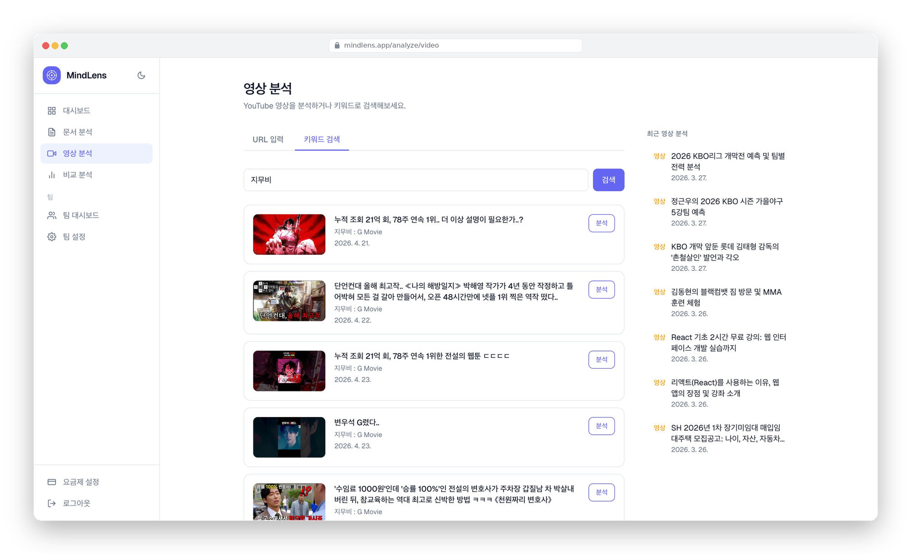
</p>

<br>

---

### 3-3 비교 분석 (Compare Analysis)
- 기존 분석 결과 2~3개를 선택하여 AI가 공통점 · 차이점 · 종합 인사이트 비교 분석
- 문서 + 영상 교차 비교 지원
- 비교 결과에서 각 콘텐츠를 [1][2][3] 형식으로 구분하여 제목 노출 없이 요약

<p align="center">
  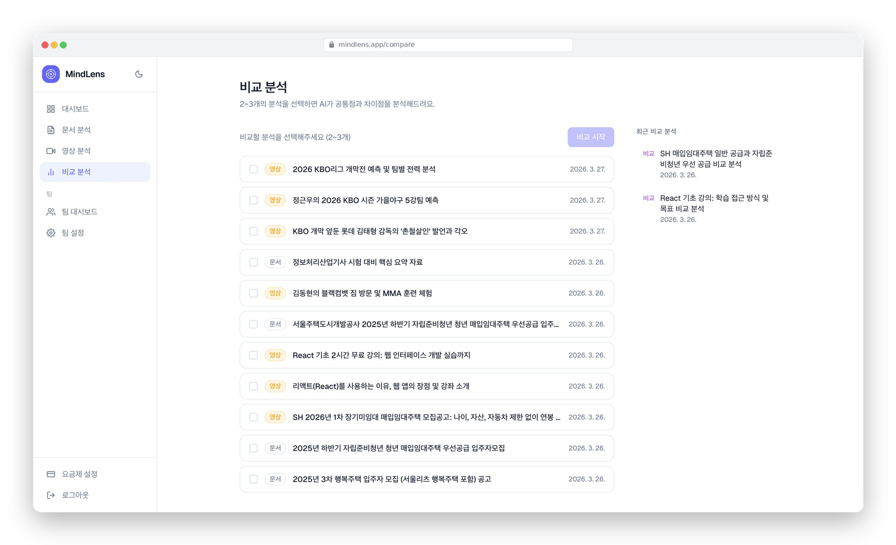
</p>

<br>

---

### 3-4 AI Q&A 채팅 (Chat)
- 분석 결과를 컨텍스트로 Gemini와 실시간 스트리밍 Q&A 채팅
- 분석 내용 기반 추천 질문 자동 생성으로 사용자 진입 장벽 최소화

<br>

---

### 3-5 대시보드 (Dashboard)
- 분석 히스토리를 카드 형태로 관리, 즐겨찾기 시 상단 정렬
- 선택 모드로 다중 삭제 · 팀 대시보드 추가 가능
- 무료 플랜 사용자에게만 월 사용량 `N / 5` 표시

<br>

---

### 3-6 팀 기능 (Team)
- Team 플랜 구독 시 팀 생성 · 이메일 초대 · 역할 관리(Leader / Admin / Member / Viewer)
- 팀 공유 대시보드에서 즐겨찾기 · 페이지네이션 · 선택 삭제
- 역할별 권한 제어: 삭제는 Admin 이상, 추가는 Member 이상, 조회는 전체

<p align="center">
  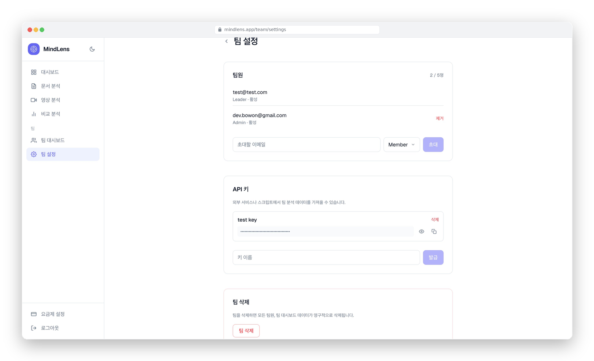
  &nbsp;
  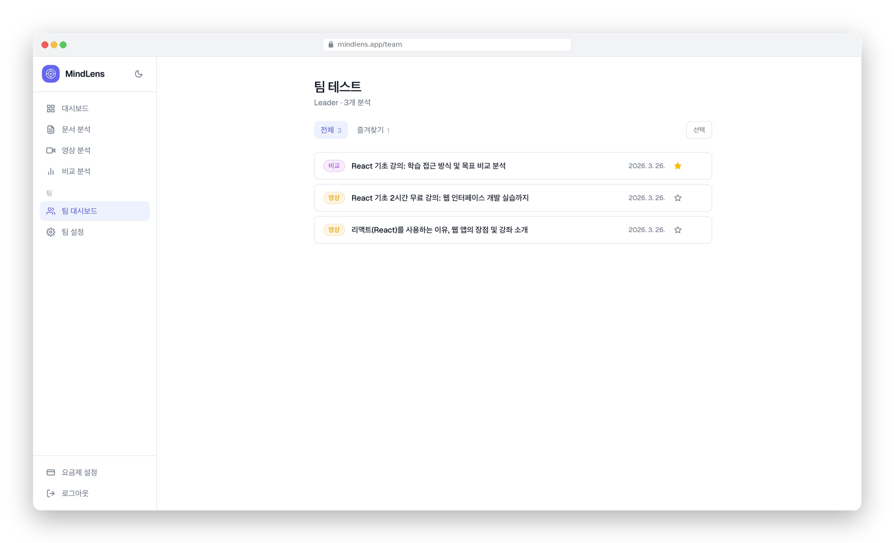
</p>

<br>

---

### 3-7 내보내기 및 공유 (Export & Share)
- 분석 결과를 PDF 또는 Markdown 파일로 다운로드
- 공유 링크 생성 시 `share_token` 발급 → 로그인 없이 `/share/[token]`에서 열람 가능
- 공유 링크 해제로 외부 접근 즉시 차단

<br>

---

### 3-8 팀 API (Team API)
- Team 플랜에서 API 키 발급 · 관리 (SHA-256 해시 저장)
- Bearer 토큰 인증 방식의 공개 API (`/api/v1/analyses`)로 팀 분석 결과 외부 조회
- 타입 필터링 · 페이지네이션(limit/offset) 지원

<br>

---

### 3-9 요금제 및 결제 (Pricing)
- 무료 / Pro(₩9,900) / Team(₩29,900) 3단계 플랜
- Toss Payments 카드 결제 연동
- 다운그레이드 시 현재 결제 기간 유지 후 만료 시 자동 전환

<p align="center">
  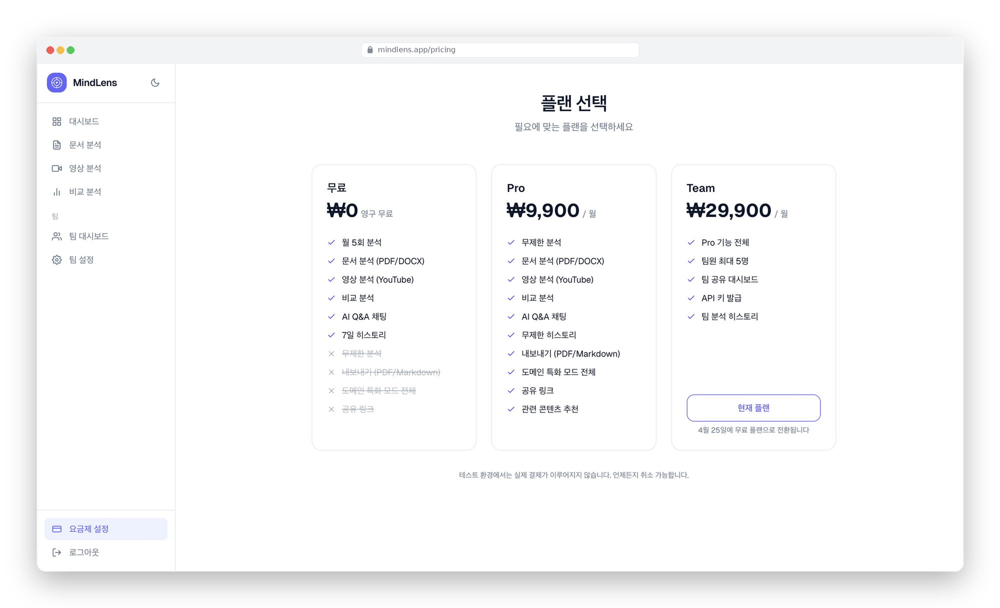
</p>

```ts
// 결제 기간 만료 시 lazy cleanup (layout.tsx)
if (isExpired) {
  await supabase.from("subscriptions").update({ status: "cancelled" })...;
  if (subscription?.plan === "team") {
    // 팀 데이터 순차 삭제 (team_analyses → team_members → teams)
  }
}
```

<br>

## 4-프로젝트 세부과정
### 4-1 [Feature 1] Gemini API 연동 및 프롬프트 설계

> 도메인 특화 프롬프트 DB 관리 및 JSON 응답 파싱
- `domain_configs` 테이블에 도메인별 `prompt_instruction`을 저장하여 런타임에 동적 조회
- Gemini 응답을 JSON으로 강제하고 마크다운 코드블록 제거 후 파싱
- 분석 실패 시 `502` 응답으로 AI 오류와 서버 오류 구분

```ts
const raw = response.response.text().trim();
const json = raw
  .replace(/^```json\s*/i, "")
  .replace(/^```\s*/i, "")
  .replace(/```\s*$/i, "")
  .trim();
result = JSON.parse(json);
```

<br>

### 4-2 [Feature 2] Supabase RLS 기반 접근 제어

> 테이블별 Row Level Security 정책으로 데이터 격리
- `analyses`, `documents`, `usage` 등 전체 테이블에 RLS 활성화
- 팀 테이블(`team_analyses`, `team_members`)은 역할별 세분화된 정책 적용
- 서버 액션에서도 사용자 세션 기반 Supabase 클라이언트를 사용하여 RLS 준수

```sql
-- 팀 멤버만 팀 분석 조회 가능
CREATE POLICY "member_read" ON team_analyses FOR SELECT
USING (team_id IN (
  SELECT team_id FROM team_members
  WHERE user_id = auth.uid() AND status = 'active'
));
```

<br>

### 4-3 [Feature 3] 구독 결제 기간 관리

> cancel_at_period_end 방식의 다운그레이드 구현
- 결제 시 `current_period_end = 결제일 + 30일` 저장
- 다운그레이드 시 즉시 취소 대신 `cancel_at_period_end = true`로 표시
- 이후 `isUsageLimitExceeded` 및 layout에서 기간 만료 여부를 실시간 판단

```ts
// lib/usage.ts — 기간 내 cancel_at_period_end는 유료로 취급
const isExpired =
  sub?.cancel_at_period_end &&
  sub.current_period_end &&
  new Date(sub.current_period_end) <= new Date();

if (!isExpired && (sub?.plan === "pro" || sub?.plan === "team")) return false;
```

<br>

### 4-4 [Feature 4] YouTube API 연동

> YouTube Data API v3 + Supadata API 기반 영상 정보 수집
- YouTube URL에서 영상 ID 추출 후 Supadata API(`/api/transcript`)로 자막 텍스트 수집
- 기존 `youtube-transcript` 라이브러리 사용 시 서버 환경에서 간헐적 실패 발생 → Supadata API로 대체
- 클라이언트 대체 방식으로 `youtubei.js` 기반 자막 추출도 구현 (`lib/youtube-transcript.ts`)
- YouTube Data API v3 `videos?part=snippet` 엔드포인트로 영상 제목 · 업로드 날짜 조회
- `videos?part=contentDetails`로 자막 유무 사전 확인 후 사용자에게 안내
- 자막이 없거나 비공개 영상일 경우 `422` 응답으로 사용자에게 안내
- 키워드 검색은 `search?part=snippet&type=video` 엔드포인트로 관련 영상 Top 5 반환

```ts
// Supadata API로 자막 추출 (transcript/route.ts)
const res = await fetch(
  `https://api.supadata.ai/v1/youtube/transcript?videoId=${encodeURIComponent(videoId)}&text=true`,
  { headers: { "x-api-key": apiKey } }
);
const data = await res.json() as { content?: string };
const transcript = data.content?.trim();
```

<br>

### 4-5 [Feature 5] 무료 플랜 사용량 제한

> 월별 사용량 카운트 기반 분석 횟수 제한
- `usage` 테이블에 `user_id + month` 복합 유니크 키로 월별 카운트 관리
- 문서 / 영상 / 비교 분석 API 모두 동일한 `isUsageLimitExceeded` 유틸로 통합 검사
- Pro / Team 플랜(유효기간 내 포함) 사용자는 제한 없이 통과

```ts
export async function isUsageLimitExceeded(supabase, userId): Promise<boolean> {
  // 유료 플랜이면 제한 없음
  if (!isExpired && (sub?.plan === "pro" || sub?.plan === "team")) return false;
  // 무료: 이번 달 카운트 확인
  return (usage?.count ?? 0) >= FREE_LIMIT;
}
```

<br>

### 4-6 [Feature 6] 팀 역할 기반 권한 제어

> Leader / Admin / Member / Viewer 4단계 역할 관리
- 팀 생성 시 소유자를 `team_members`에 `owner` 역할로 자동 추가
- 초대 시 역할 선택(Admin / Member / Viewer), 각 역할별 설명 커스텀 드롭다운으로 제공
- 팀 삭제는 Leader만 가능, 분석 제거는 Admin 이상만 가능

<br>

## 5-업데이트 및 리팩토링 사항
### 5-1 우선순위별 개선항목

#### P1. 기능 보완 (High)

1) 팀 기능
- [x] 팀 생성 · 초대 · 역할 관리
- [x] 팀 공유 대시보드 (즐겨찾기 / 페이지네이션 / 선택 삭제)
- [x] 팀 설정 사이드바 이동 (Leader만 표시)
- [x] 팀원 최대 인원(5명) 제한 적용

2) 결제 · 요금제
- [x] Toss Payments 카드 결제 연동
- [x] 다운그레이드 시 결제 기간 유지 후 만료 전환
- [x] 무료 플랜 월 분석 횟수 제한 (문서 / 영상 / 비교 통합)
- [ ] 구독 갱신 웹훅 처리 (현재 30일 고정)

#### P2. UI / UX 개선 (Medium)

1) 대시보드
- [x] 즐겨찾기 시 즉시 상단 정렬 (낙관적 업데이트)
- [x] 선택 모드 — 다중 삭제 · 팀 추가
- [x] 무료 플랜에만 `N / 5` 사용량 표시

2) 요금제 페이지
- [x] 서버 컴포넌트로 초기 플랜 fetch → flash 방지
- [x] 다운그레이드 후 만료일 표시 및 버튼 상태 처리

#### P3. 인프라 · 보안 (Medium)

1) 메타데이터 · SEO
- [x] OG 이미지 동적 생성 (`next/og` ImageResponse)
- [x] 전체 메타데이터 설정 (title template / description / keywords)

2) Supabase RLS
- [x] 전체 테이블 RLS 정책 정비 (SELECT / INSERT / UPDATE / DELETE)

### 5-2 그 외 항목

1) 완료된 기능
- [x] 콘텐츠 연결 추천 (분석한 문서 관련 YouTube 자동 추천)
- [x] 분석 결과 내보내기 (PDF / Markdown 다운로드)
- [x] 공유 링크 생성 및 해제
- [x] 팀 API 키 발급 및 공개 API (`/api/v1/analyses`)
- [x] YouTube 자막 추출 Supadata API로 전환 (서버 안정성 개선)
- [x] 자막 유무 사전 확인 기능 (`contentDetails.caption`)


<br>
